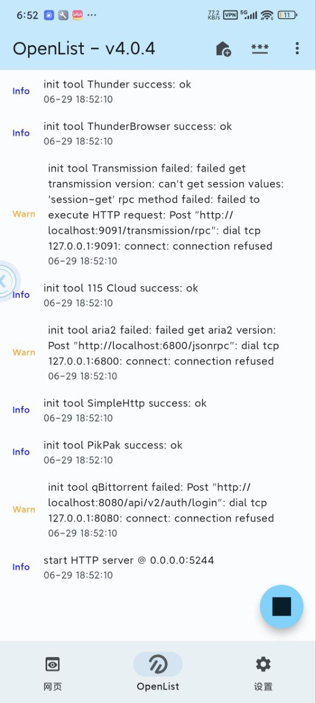

[](https://github.com/Suyunmeng/OpenListFlutter/actions/workflows/release.yaml)
[](https://github.com/Suyunmeng/OpenListFlutter/actions/workflows/build.yaml)
[](https://github.com/Suyunmeng/OpenListFlutter/actions/workflows/sync_openlist.yaml)

#### 🚩　[FRP](https://github.com/fatedier/frp) 安卓版本：https://github.com/jing332/FrpAndroid
#### 🚩　[AListAndroid](https://github.com/jing332/AlistAndroid) Compose版本，已停更

# OpenListFlutter

OpenListFlutter是一个基于OpenList的Android和iOS服务端，使用Google Flutter作为UI框架。

> [Github Actions](https://github.com/Suyunmeng/OpenListFlutter/actions/workflows/sync_openlist.yaml)
> 每日早晚五点钟检查最新的 [OpenList](https://github.com/OpenListTeam/OpenList/releases)
> 并自动构建APK和IPA，发布到 [Release](https://github.com/Suyunmeng/OpenListFlutter/releases)
> 中，您只需耐心等待片刻并在应用内检查更新即可。



### Bug
- Android4.4闪退 https://github.com/jing332/AListFlutter/issues/5
- 部分设备无法添加本地存储 https://github.com/jing332/AListFlutter/issues/2

### 关于iOS
现已添加iOS构建支持！iOS版本需要在macOS环境下构建。

#### iOS构建要求
- macOS系统
- Xcode (从App Store安装)
- CocoaPods (`sudo gem install cocoapods`)
- Flutter SDK

#### iOS构建步骤
1. 确保满足上述要求
2. 运行设置脚本：`./scripts/setup_ios.sh`
3. 或手动执行：
   ```bash
   flutter clean
   flutter pub get
   cd ios && pod install
   ```
4. 构建iOS应用：
   - 模拟器版本：`flutter build ios --debug --no-codesign`
   - 真机版本：`flutter build ios --release` (需要代码签名)
5. 在Xcode中打开：`open ios/Runner.xcworkspace`

#### iOS代码签名配置
iOS真机运行和App Store发布需要代码签名：

1. **自动签名** (推荐)：
   ```bash
   # 在Xcode中启用"Automatically manage signing"
   open ios/Runner.xcworkspace
   ```

2. **手动签名**：
   ```bash
   # 运行代码签名配置脚本
   ./scripts/setup_codesign.sh
   ```

3. **自动化构建**：
   ```bash
   # 基本构建 (无签名)
   ./scripts/build_ios.sh
   
   # 带签名构建
   ./scripts/build_ios.sh --sign
   
   # Archive并导出IPA
   ./scripts/build_ios.sh --sign --archive
   ```

#### iOS模拟器运行
```bash
flutter run -d ios
```

详细的代码签名配置请参考：[iOS代码签名指南](docs/iOS_CodeSigning.md)

## 发布流程

### 自动发布
项目支持自动发布Android APK和iOS IPA：

1. **触发条件**：
   - 推送CHANGELOG.md到master分支
   - 手动触发Release工作流

2. **发布内容**：
   - Android APK（多架构分包）
   - iOS IPA（带代码签名，可直接上传App Store）

3. **配置要求**：
   - Android：需要配置签名密钥Secrets
   - iOS：需要配置代码签名证书和App Store Connect API密钥

详细配置请参考：[GitHub Secrets配置指南](docs/GitHub_Secrets_Setup.md)

# Download

- [Github Release](https://github.com/Suyunmeng/OpenListFlutter/releases) 正式版
- [Github Action (DEV)](https://github.com/Suyunmeng/OpenListFlutter/actions/workflows/build.yaml) 开发版